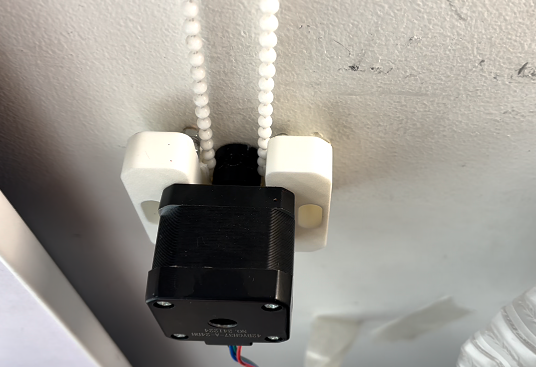
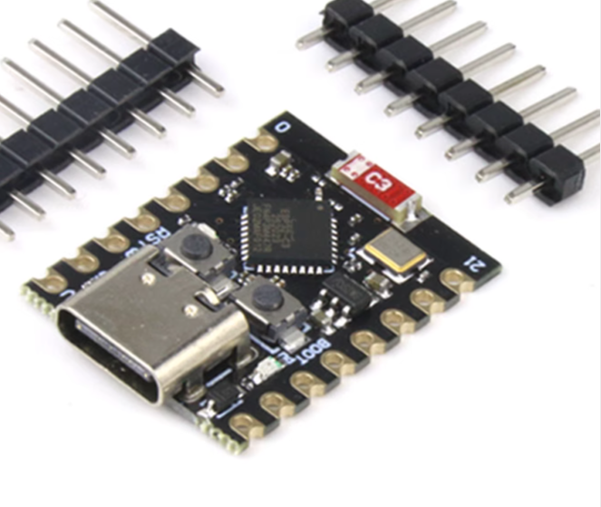
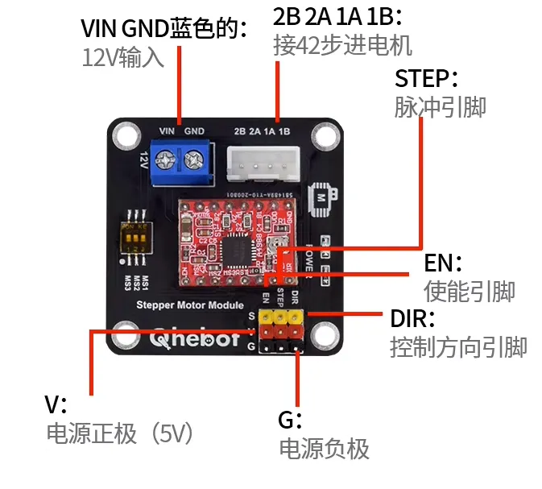
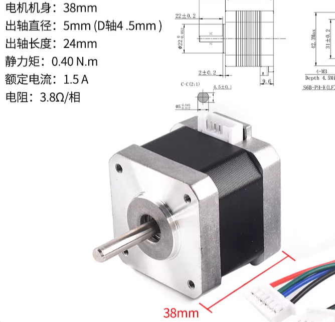
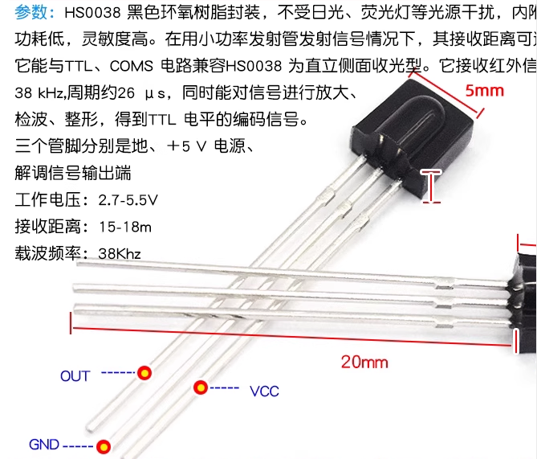
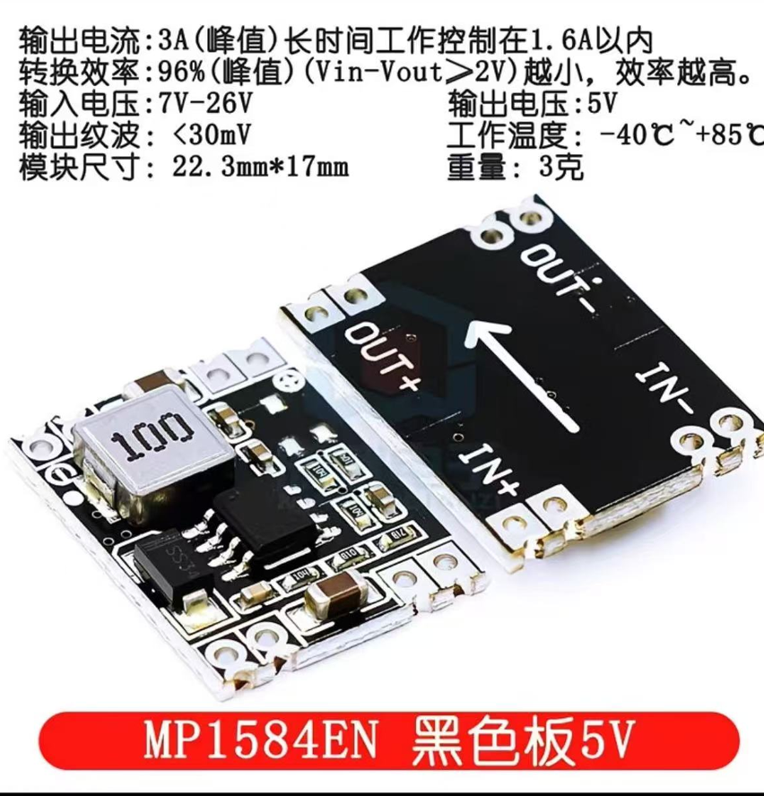

# ESP32 智能卷帘控制系统

基于ESP32和A4988步进电机驱动器的智能卷帘控制系统，支持红外遥控操作和时间设置。
### 安装效果展示



## 🚀 快速开始

### 硬件组件展示

| 组件 | 图片 | 说明 |
|------|------|------|
| ESP32-C3-Mini |  | 主控制器 |
| A4988驱动扩展板 |  | 步进电机驱动器 |
| 42步进电机 |  | 动力源 |
| HS-0038B红外接收 |  | 红外遥控接收 |
| DC-DC降压模块 |  | 电源转换 |

### 硬件连接
```
ESP32 GPIO 6  -> A4988 STEP
ESP32 GPIO 7  -> A4988 DIR  
ESP32 GPIO 8  -> A4988 ENABLE
ESP32 GPIO 9  -> 红外接收模块 OUT
ESP32 3.3V    -> A4988 VDD, 红外接收模块 VCC
ESP32 GND     -> A4988 GND, 红外接收模块 GND
12V电源       -> A4988 VMOT
12V电源GND    -> A4988 GND
```

### 软件环境
1. 安装Arduino IDE
2. 安装ESP32开发板支持包
3. 安装IRremote库
4. 上传代码到ESP32

## 🎮 遥控器功能

| 按键 | 功能 | 说明 |
|------|------|------|
| 上键 | 升起窗帘 | 转动设定时间 |
| 下键 | 放下窗帘 | 转动设定时间 |
| 左键 | 微调升起 | 短时间调整 |
| 右键 | 微调放下 | 短时间调整 |
| 设置键 | 时间设置 | 进入/退出设置模式 |
| 中间键 | 停止电机 | 紧急停止 |
| 0键 | 切换方向 | 改变电机转动方向 |

## 遥控器按键匹配说明
运行本项目后，使用红外遥控器按下各个按键，观察串口调试信息中显示的按键数值。根据实际接收到的数值，在`config.h`文件中相应地修改按键对应的参数，即可完成按键功能的自定义和匹配。
[14:37:16.671] [IR] 协议:8 地址:0x80 命令:0x1E
[14:37:16.705] [INFO] 接收到有效红外命令: 0x1E
[14:37:16.705] [WARN] 未知命令: 0x1E - 请使用正确的按键或检查遥控器
## ⚙️ 时间设置

1. 按**设置键**进入设置模式
2. 系统开始关闭窗帘并计时
3. 窗帘完全关闭后，再次按**设置键**
4. 时间自动保存到EEPROM

## 🔧 技术参数

- **电机**: 42步进电机，200步/圈，1/16微步进
- **速度**: 600步/秒（可调200-1000）
- **默认时间**: 5000毫秒
- **微调时间**: 1000毫秒
- **红外地址**: 0xBF00

## 📁 文件结构

```
├── skech_smart_roller_blind/
│   ├── skech_smart_roller_blind.ino  # 主程序
│   └── config.h                      # 配置文件
├── 3dmodel/                          # 3D打印文件
├── art/                              # 硬件图片
└── README.md
```

## 🛠️ 3D打印
注意 3D模型来自 https://printables.com/model/1328338-high-torque-motorised-roller-blinds-mount
感谢作者Tmate，请尊重模型的版权。
项目包含完整的3D打印文件：
- `gear.stl` - 齿轮
- `mount.stl` - 支架


## 🔍 故障排除

| 问题 | 解决方案 |
|------|----------|
| 电机不转 | 检查12V电源和A4988连接 |
| 红外无响应 | 检查0038k模块连接和遥控器电池 |
| 转动不准确 | 重新进入设置模式校准时间 |
| 设置不保存 | 连续3次按中间键清除存储 |

## ⚠️ 注意事项

- 调试过程中严格操作，注意安全 
- 使用12V电源
- 确保所有连接牢固
- 避免短路和过载
