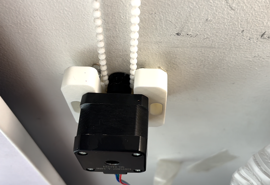
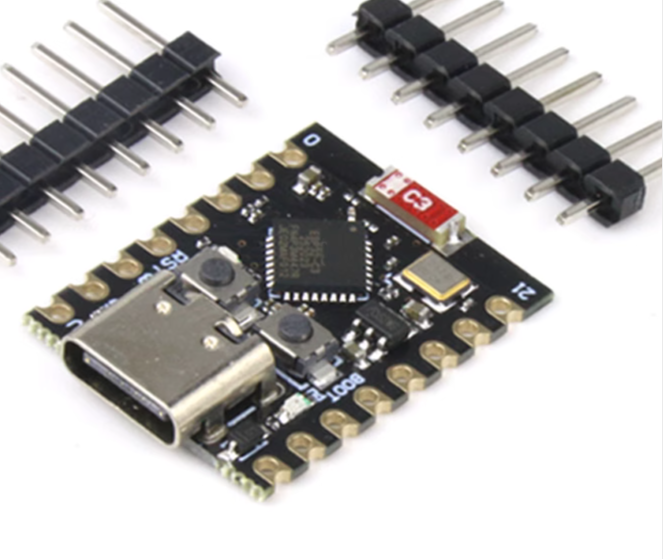
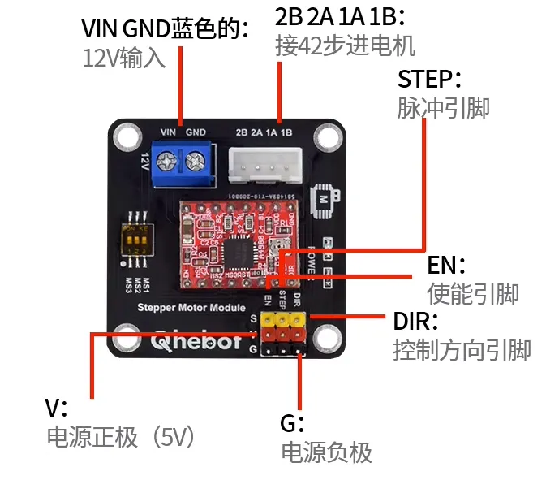
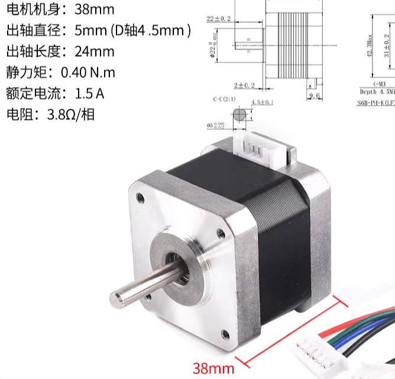
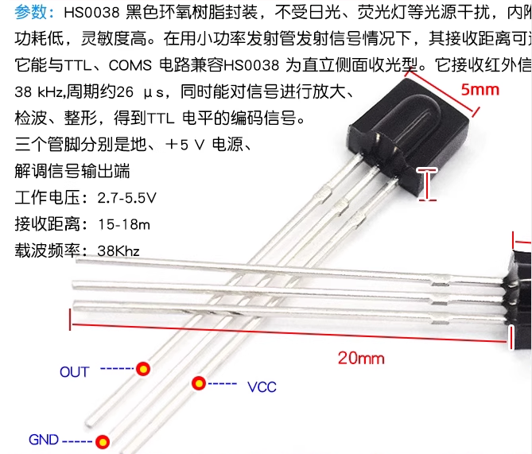
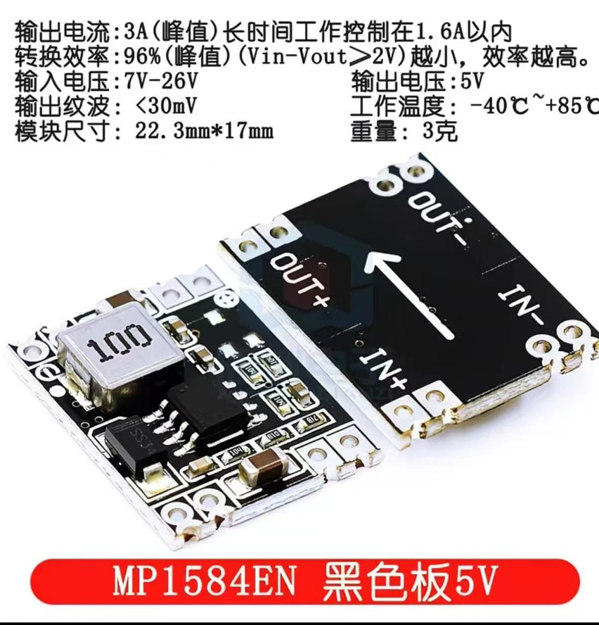
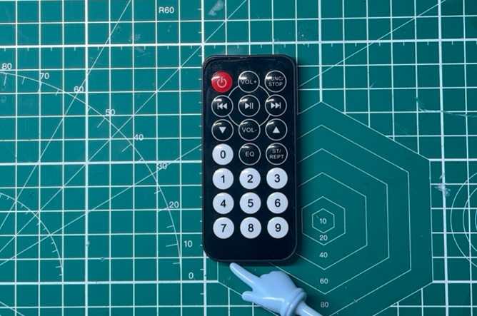

# ESP32 智能卷帘控制系统

基于ESP32和A4988步进电机驱动器的智能卷帘控制系统，支持红外遥控、蓝牙APP控制。

## 📱 系统展示

### 安装效果



### APP操作演示


## 🚀 快速开始

### 硬件组件

| 组件 | 图片 | 说明 |
|------|------|------|
| ESP32-C3-Mini |  | 主控制器，支持WiFi和蓝牙 |
| A4988驱动扩展板 |  | 步进电机驱动器 |
| 42步进电机 |  | 动力源，200步/圈 |
| HS-0038B红外接收 |  | 红外遥控接收模块 |
| DC-DC降压模块 |  | 12V转5V电源转换 |
| 红外遥控器 |  | 遥控操作设备 |

### 硬件连接
```
ESP32 GPIO 6  -> A4988 STEP
ESP32 GPIO 7  -> A4988 DIR  
ESP32 GPIO 8  -> A4988 ENABLE
ESP32 GPIO 9  -> 红外接收模块 OUT
ESP32 3.3V    -> A4988 VDD, 红外接收模块 VCC
ESP32 GND     -> A4988 GND, 红外接收模块 GND
12V电源       -> A4988 VMOT
12V电源GND    -> A4988 GND
```

## 📱 Android APP

### 功能特性
- **蓝牙连接**: 通过BLE与ESP32设备连接
- **实时控制**: 支持窗帘的开启、关闭、停止操作
- **状态显示**: 实时显示设备连接状态和窗帘位置
- **微调功能**: 支持小幅度的窗帘位置调整
- **设置模式**: 可进入设置模式校准窗帘运行时间

### APP安装
1. 下载 `archives/app-release.apk`
2. 在Android设备上安装APK文件
3. 打开APP并授予蓝牙权限
4. 搜索并连接ESP32设备

### APP界面说明
- **连接状态**: 显示设备连接状态
- **控制按钮**: 开启、关闭、停止、微调等操作
- **设置按钮**: 进入时间设置模式
- **刷新按钮**: 重新搜索设备

## 🎮 控制方式

### 红外遥控器功能

| 按键 | 功能 | 说明 |
|------|------|------|
| 上键 | 升起窗帘 | 转动设定时间 |
| 下键 | 放下窗帘 | 转动设定时间 |
| 左键 | 微调升起 | 短时间调整 |
| 右键 | 微调放下 | 短时间调整 |
| 设置键 | 时间设置 | 进入/退出设置模式 |
| 中间键 | 停止电机 | 紧急停止 |
| 0键 | 切换方向 | 改变电机转动方向 |

### 蓝牙APP控制
- **升起/下降**: 通过APP按钮控制窗帘完全开启或关闭
- **停止**: 随时停止窗帘运动
- **微调升起/微调下降**: 小幅度的位置调整
- **设置**: 进入时间校准模式

## ⚙️ 时间设置

### 设置步骤
1. 按**设置键**（遥控器）或点击**设置按钮**（APP）进入设置模式
2. 系统开始关闭窗帘并计时
3. 窗帘完全关闭后，再次按**设置键**或点击**设置按钮**
4. 时间自动保存到EEPROM

### 调试信息
运行项目后，观察串口调试信息：
```
[14:37:16.671] [IR] 协议:8 地址:0x80 命令:0x1E
[14:37:16.705] [INFO] 接收到有效红外命令: 0x1E
[14:37:16.705] [WARN] 未知命令: 0x1E - 请使用正确的按键或检查遥控器
```

## 🔧 技术参数

- **电机**: 42步进电机，200步/圈，1/16微步进
- **速度**: 600步/秒（可调200-1000）
- **默认时间**: 5000毫秒
- **微调时间**: 1000毫秒
- **红外地址**: 0xBF00
- **蓝牙**: BLE 4.0
- **电源**: 12V直流供电

## 📁 项目结构

```
Esp32_smart_roller_blind/
├── code/
│   ├── arduino_esp32/                    # ESP32固件代码
│   │   └── skech_smart_roller_blind/
│   │       ├── skech_smart_roller_blind.ino  # 主程序
│   │       ├── BLEHandler.cpp/.h         # 蓝牙处理
│   │       └── config.h                  # 配置文件
│   └── android/                          # Android APP源码
│       └── RollerBlindControllerApp/
├── 3dmodel/                              # 3D打印文件
│   ├── gear.stl                          # 齿轮
│   └── mount.stl                         # 支架
├── art/                                  # 硬件图片和APP截图
├── archives/                             # 发布文件
│   ├── app-release.apk                   # Android APP安装包
│   └── smart_roller_blind_*.bin          # ESP32固件
└── README.md
```

## 🛠️ 开发环境

### Arduino固件开发
1. 安装Arduino IDE
2. 安装ESP32开发板支持包
3. 安装IRremote库
4. 上传代码到ESP32

### Android APP开发
1. 安装Android Studio
2. 导入项目到Android Studio
3. 配置Gradle依赖
4. 编译生成APK

## 🖨️ 3D打印

**注意**: 3D模型来自 [Printables](https://printables.com/model/1328338-high-torque-motorised-roller-blinds-mount)

感谢作者Tmate，请尊重模型的版权。

项目包含完整的3D打印文件：
- `gear.stl` - 齿轮
- `mount.stl` - 支架

## 🔍 故障排除

| 问题 | 解决方案 |
|------|----------|
| 电机不转 | 检查12V电源和A4988连接 |
| 红外无响应 | 检查HS-0038B模块连接和遥控器电池 |
| 蓝牙连接失败 | 检查ESP32蓝牙功能，重启设备 |
| APP无法连接 | 确认设备在蓝牙范围内，重新搜索 |
| 转动不准确 | 重新进入设置模式校准时间 |
| 设置不保存 | 连续3次按中间键清除存储 |

## ⚠️ 安全注意事项

- 调试过程中严格操作，注意安全
- 使用12V电源，确保电源适配器质量
- 确保所有连接牢固，避免松动
- 避免短路和过载
- 安装时注意窗帘重量，确保支架牢固

## 📄 许可证

本项目仅供学习和个人使用，请遵守相关法律法规。

## 🤝 贡献

欢迎提交Issue和Pull Request来改进项目。

---

**项目特色**: 支持红外遥控和蓝牙APP双重控制，操作简单，安装方便。